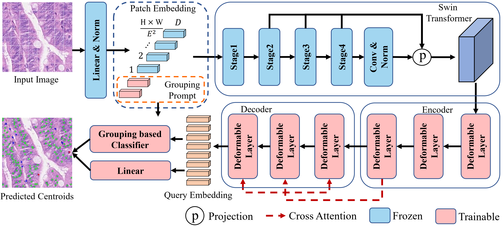

# PGT
Prompt-based Grouping Transformer for Nucleus Detection and Classification

## Overall Framework

## Requisities
-`python=3.8`

-`pytorch=1.12.1+cu102`


## Installation
Install mmcv using mim
```
pip install -U openmim
mim install mmcv-full==1.6.1
```
Git clone acformer
```
git clone https://github.com/LL3RD/PGT.git
```

Install
```
cd PGT
cd thirdparty/mmdetection
python -m pip install -e .
cd ../..
python -m pip install -e .
```

## Dataset & Result

### CoNSeP Dataset
Your can download [20x CoNSeP Dataset and Checkpoint](https://drive.google.com/file/d/1BEjjizMwWHdBLgz5da8LmP1hXXzSVI54/view?usp=sharing) from here.

| Method | F1d   | F1c | Model Weights  | Config Files                           |
| ---- |-------| ----- |----------------|----------------------------------------|
| PGT | 0.738 | 0.613 | [Checkpoint](https://drive.google.com/file/d/1BEjjizMwWHdBLgz5da8LmP1hXXzSVI54/view?usp=sharing) | [Config](./configs/Swin_CoNSeP_PGT.py) |

### BRCA Dataset
Your can download [BRCA Dataset and Checkpoint](https://drive.google.com/file/d/1R6IBHoPKCCeHloog_3E8UVkifHyED2bO/view?usp=sharing) from here.

| Method | F1d   | F1c   | Model Weights | Config Files                         |
|--------|-------|-------|----|--------------------------------------|
| PGT    | 0.799 | 0.523 | [Checkpoint](https://drive.google.com/file/d/1R6IBHoPKCCeHloog_3E8UVkifHyED2bO/view?usp=sharing)| [Config](./configs/Swin_BRCA_PGT.py) |

### Lizard Dataset
Your can download [Original Lizard](https://warwick.ac.uk/fac/cross_fac/tia/data/lizard) from the official website or [Preprocessed Lizard and Checkpoint](zzz) that is converted to hovernet consep format and split into patches.

| Method | F1d   | F1c   | Model Weights     | Config Files                           |
|--------|-------|-------|-------------------|----------------------------------------|
| PGT    | 0.779 | 0.538 | [Checkpoint](zzz) | [Config](./configs/Swin_Lizard_PGT.py) |


## Training
Modify your dataset path in configs and run
```
CUDA_VISIBLE_DEVICES=0 bash tools/dist_train.sh configs/Swin_CoNSeP_PGT.py 1 --work-dir=Path_to_your_work_dir
```

## Evaluation
Modify your dataset path and checkpoint path in tools/inference and run
```
python tools/inference/inference_CoNSeP_group.py
```
```
python tools/inference/inference_BRCA_group.py
```
```
python tools/inference/inference_Lizard_group.py
```


## Acknowledgement
- PGT is built based on [SoftTeacher](https://github.com/microsoft/SoftTeacher) and [MMDetection](https://github.com/open-mmlab/mmdetection).
